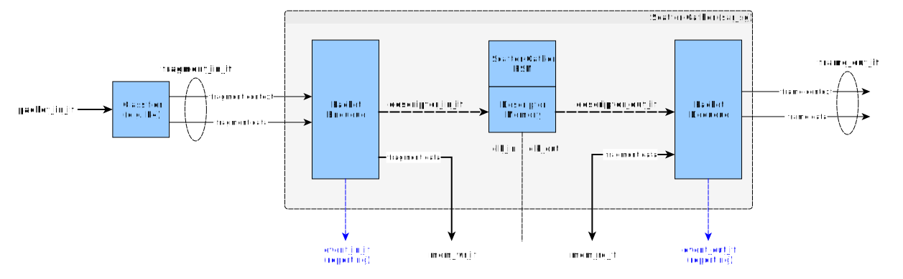

Scatter-Gather Controller
=========================
The scatter-gather controller receives a stream of data fragments, where each data fragment is a component of a larger data frame. The fragments are written into memory; for memory bandwidth optimization purposes, the fragments may be stored in any location, such that they may be 'scattered' across the memory. For each fragment, a descriptor is generated that records the frame context, address and length of the fragment, so that it can be retrieved at a later time. For each data frame, a linked list of descriptors corresponding to the fragments comprising the data frame is built up. Once the entire frame is available, the linked list is traversed to read (gather) each fragment one by one from the memory, to assemble the full data frame.

Diagram
-------

Memory Selection
----------------
The scatter-gather controller is designed to be agnostic (mostly) to the selection of the physical memory technology for storing frame data. This is accomplished by exposing generic memory write/read interfaces instead of embedding the memories within the SG module itself.

Initially the memory interfaces will be connected to (on-chip) BRAMs for prototyping. Eventually, the interfaces will connect to HBM to scale up the frame size, number of contexts, number of fragments, etc. supported by the implementation.

Design Considerations
---------------------
Complexity greatly depends on the robustness of the solution to missing, reordered or retransmitted fragments.

The simplest implementation involves handling the case where a stream of (in-order) fragments is received. The fragments can be stored arbitrarily in the memory, but only an `append` operation is required to maintain the linked list of descriptors. This is O(1) so is straightforward to implement in hardware.

To support out-of-order reception of the fragments, it is necessary to additionally support an `insert` operation. This is generally O(n) which makes it difficult to implement. By maintaining additional state (and bounding the number of out-of-order segments that are supported) it may be possible to reduce the complexity of the insert operation to O(1), at the expense of a much more complex design.

To support missing fragments, timers need to be maintained; a timeout would serve as an (indirect) indication that one or more fragments were missing and the data frame could not be recovered.

To start, the planned implementation will be the simplest one. A linked list of descriptors is maintained per data context (i.e. frame) and the frame is unpacked only when all fragments have been received.